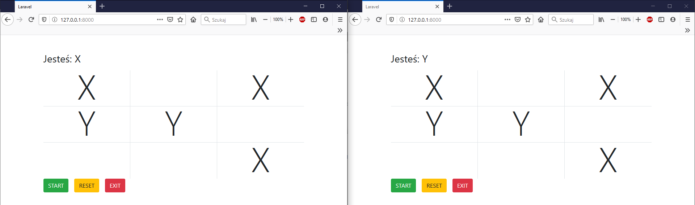

## Tic Tac Toe - XY Version

Instalation:\
<code>composer install</code>\
next:\
<code>php artisan migrate</code>\
and run WebSocket server:\
<code>php artisan websocket:init</code>\
and run local server from artisan:\
<code>php artisan serve</code>

Open browsers http://127.0.0.1:8000, click start in both and start play. 
If you finish game click reset in one of browsers. 
Next refresh browsers and again click start in both and play.

PS: Take in mind - it's illustrative example.

